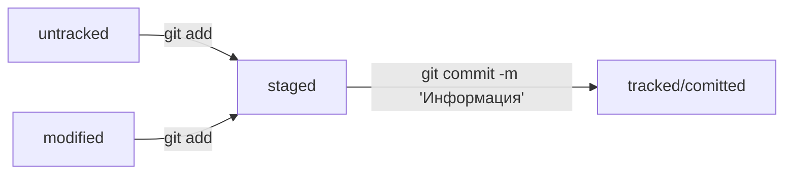

# Шпаргалка по работе с Git

В этом документе приведена информация для базовой работы с git.

## Работа с локальным репозиторием

### Инициализация локального репозитория
Для создание локального репозитория необходимо выполнить следующую команду:

```bash
git init
```

### Проверка статуса
Узнать текущее состояние репозитория:

```bash
git status
```

### Работа с файлами


Добавить все файлы из текущей директории.

```bash
git add .
```

Добавить все файлы из текущей и вложенных директорий:

```bash
git add *
```
или

```bash
git add --all
```

Обновление файлов в репозитории:
```bash
git add -u

```

### Сохранение изменений

```bash
git commit -m "Комментарий!"
```


## Работа с удаленным репозиторием

Подключить удаленный репозиторий:

```bash
git remote add origin ssh://user@host/username/project
```

Отправить все изменнеия в удаленный репозиторий:

```bash
git push -u origin master
```

или

```bash
git push -u origin main
```

## Что такое HEAD 

HEAD указывает на самый последний коммит.  
Его можно использовать как псевдоним в командах.

## Жизненный цикл файлов

Все файла находятся в одном их состоянии:

- tracked
- untracked

Файлы в состоянии **tracked** могут находится также в следующих в состояниях:

- modified
- staged ("корзинка" для коммита)



## Журнал коммитов

Для просмотра журнала изменений необходимо выполнить следующую команду:
```bash
git log
```

Для краткого вывода информации:
```bash
git log --oneline
```

В обоих случая выводится уникальный хэш коммита. Длину хэша git автоматически определяет исходят из требований уникальности.
